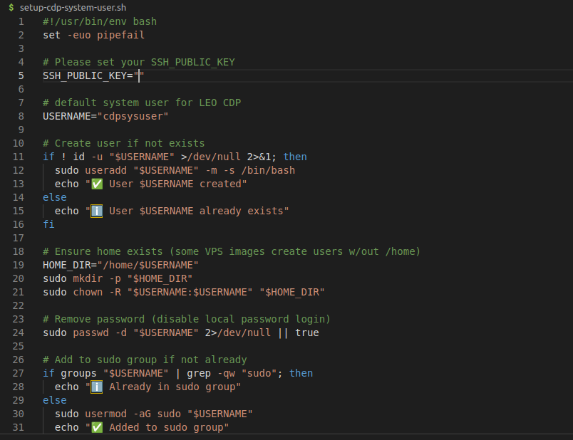

# LEO CDP Deployment

**LEO Customer Data Platform (CDP)** — *Free Edition for on-premise or cloud environments.*

## Overview


LEO CDP Free Edition provides a complete environment to manage customer data, including:

* Admin Dashboard for system management
* Data Hub for observer access
* LEO Bot for FAQs and content creation
* Database backup and retention management
* Messaging through Kafka or local queues
* Pre-packaged JAR files for core services and jobs

---

## 📁 Repository Structure


```
.
CDP.RELEASE/
│
├── chrome-ext/     # Browser extension for tracking support
├── configs/      # Environment configuration (env, database, app.yml, etc.)
├── data/        # Demo data or initialization samples
├── deps/        # Dependency libraries (JARs, scripts, etc.)
├── devops-script/   # CI/CD or Azure DevOps pipeline scripts
├── docs/        # Deployment and technical documentation
├── public/       # Static assets, logos, HTML templates
├── resources/     # Internal configuration files (properties, metadata)
├── script-new-installation/ # Installation package for fresh setup
├── static-data/     # Sample dataset, e.g.,sample-fake-customer.csv, GeoIP2,..
│
├── leocdp-dev-start.sh  # Start all services in the development environment
├── run-database-backup-restore.sh # Backup and restore database data
├── run-database-upgrade.sh  # Upgrade database schema
│
├── setup-arangodb3-client.sh # Install ArangoDB client
├── setup-system-user.sh  # Create the system user for this CDP instance 
├── setup-leocdp-database.sh  # Set up ArangoDB schema
├── setup-leocdp-metadata.sh  # Load initial system metadata
├── setup-leocdp-single-node.sh # Configure single-node deployment
├── setup-leocdp.sh    # Main script for initializing the entire system
│
├── start-admin.sh    # Start the Admin service
├── start-data-connector-jobs.sh # Start data connector jobs
├── start-observer.sh    # Start the Observer service
├── stop-server.sh     # Stop all running services
│
├── leo-main-starter-v_0.9.0.jar
├── leo-data-processing-starter-v_0.9.0.jar
├── leo-observer-starter-v_0.9.0.jar
├── leo-scheduler-starter-v_0.9.0.jar
│
└── README.md

```

---

## ⚙️ System Requirements

| Component     | Requirement                              |
| ------------- | ---------------------------------------- |
| OS            | Ubuntu 22.04 LTS or higher               |
| Java          | Amazon Corretto 11 *(required)*         |
| Redis         | Redis 6+ *(required)*                    |
| Database      | ArangoDB 3.11.14                         |
| Reverse Proxy | Nginx (latest stable)                    |
| Shell         | Bash 5.0+                                |
| Access        | Dedicated non-root user for all services |

---

## 🧩 Installation Workflow

All installation scripts are located in:
`script-new-installation/`

Run **each step in order** depending on the deployment context (fresh install vs existing environment).

---

### 1️⃣ Create Dedicated System User

All LEO CDP services must run under **cdpsysuser**, a non-root user, for security and process isolation.

Please check **setup-system-user.sh** for more details.

---

### 2️⃣ Configure SSH Access for the User

> Open the file **setup-system-user.sh**

```bash
nano setup-system-user.sh
```



> Paste your **SSH public key** here to enable passwordless access.

> This user will be used for deployment, upgrades, and service management.

---

### 3️⃣ Install Core Services and Dependencies

All commands should be executed as **root** or with `sudo`, before switching to `cdpsysuser`.

```bash
cd script-new-installation
sudo bash install-java.sh        # Install Java (required for all services)
sudo bash install-redis.sh       # Install Redis (required for all services)
sudo bash install-database.sh    # Install ArangoDB (required for only database services)
sudo bash install-nginx.sh       # Install Nginx (reverse proxy for Admin UI and Data Hub)
sudo bash install-certbot.sh     # Install Let's Encrypt SSL (optional if use reverse proxy)
```

---

### 4️⃣ Switch to the CDP System User

```bash
sudo su - cdpsysuser
cd /build/cdp-instance
```

Generate configuration metadata:

```bash
bash setup-leocdp-metadata.sh
```

Initialize the database:

```bash
bash setup-leocdp-database.sh
```

---

### 5️⃣ Start CDP Services

Run the services in sequence under `cdpsysuser`:

```bash
bash start-admin.sh
bash start-observer.sh
bash start-data-connector-jobs.sh
```

To stop all services:

```bash
bash stop-server.sh
```

---

## 🧰 Maintenance Operations

**Backup / Restore Database**

```bash
bash run-database-backup-restore.sh
```

**Upgrade Database Schema**

```bash
bash run-database-upgrade.sh
```

**Logs**

* All upgrade logs → `upgrade-leocdp.log`
* Individual service logs are created per JAR when started

---

## 🔐 Security & Hardening

* Never run CDP JARs as `root`
* Use `ufw` or a cloud firewall to restrict open ports
* Ensure SSL termination (Certbot or reverse proxy)
* Keep Redis and ArangoDB access limited to internal network
* Rotate SSH keys and database passwords periodically

---

## 🌐 References

* **Framework:** [https://github.com/trieu/leo-cdp-framework](https://github.com/trieu/leo-cdp-framework)
* **LEO Bot (AI Assistant):** [https://github.com/trieu/leo-bot](https://github.com/trieu/leo-bot)

---

## ✅ Quick Deployment Summary

For a single **fresh Ubuntu 22.04** server:

```bash
# 1. Create dedicated system user
sudo bash setup-cdp-system-user.sh

# 2. Install dependencies
cd script-new-installation
sudo bash install-java.sh
sudo bash install-redis.sh
sudo bash install-database.sh
sudo bash install-nginx.sh

# 3. Switch to CDP user and configure
sudo su - cdpsysuser
sudo mkdir -p /build/cdp-instance
sudo chown -R cdpsysuser:cdpsysuser /build/cdp-instance
cd /build/cdp-instance
bash setup-leocdp-metadata.sh
bash setup-leocdp-database.sh

# 4. Start services
bash start-admin.sh
bash start-observer.sh
bash start-data-connector-jobs.sh
```

Access the **Admin Dashboard** at the configured domain.
