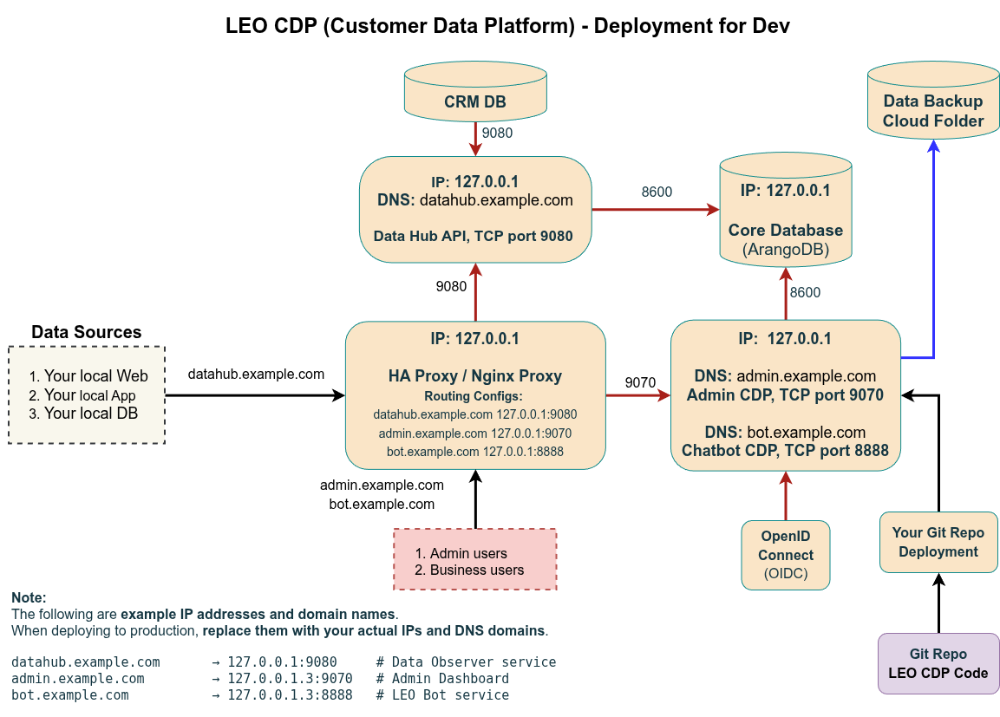

# LEO CDP Deployment for Development Environments

## 🧩 Single-Server Setup Guide 

The **single-server setup** lets you run the full **LEO CDP stack** — Admin Dashboard, Data Hub (Observer), Scheduler, and Database — on one Linux host.
It’s ideal for **local testing, development, or proof-of-concept** installations.

---

### ⚙️ System Requirements

| Component | Version                  | Description                                     |
| --------- | ------------------------ | ----------------------------------------------- |
| OS        | Ubuntu 22.04 LTS         | Recommended Linux distro                        |
| Java      | Amazon Corretto 11+      | Required for all LEO CDP `.jar` services        |
| Redis     | Redis 7+                 | Required for caching and message queues         |
| Database  | ArangoDB 3.11+           | Main CDP datastore                              |
| Nginx     | Stable open source build | For local reverse proxy and HTTPS               |
| User      | `cdpsysuser`             | Dedicated non-root user to run all CDP services |

---

### 🧱 Architecture Overview



In development mode, **all services** run on one host:

| Service                  | Role                                                   | Port        | Example URL                         |
| ------------------------ | ------------------------------------------------------ | ----------- | ----------------------------------- |
| **Admin Dashboard**      | `leo-main-starter`                                     | `9070`      | `http://localhost:9070`             |
| **Data Hub / Observer**  | `leo-observer-starter`                                 | `9080`      | `http://localhost:9080`             |
| **Scheduler / ETL Jobs** | `leo-scheduler-starter`, `leo-data-processing-starter` | background  | —                                   |
| **ArangoDB**             | Database                                               | `8600`      | `http://localhost:8600`             |
| **Redis**                | Cache / Queue                                          | `6379`      | —                                   |
| **Nginx**                | Reverse Proxy                                          | `80`, `443` | routes `/admin`, `/datahub`, `/bot` |

---

### 🚀 Step-by-Step Setup

#### 1️⃣ Create Dedicated User

LEO CDP services must not run as `root`.

```bash
sudo useradd cdpsysuser -s /bin/bash -p '*'
sudo passwd -d cdpsysuser
sudo usermod -aG sudo cdpsysuser
echo 'cdpsysuser ALL=(ALL) NOPASSWD: ALL' | sudo tee -a /etc/sudoers >/dev/null
```

Set up SSH access for local dev (optional but good habit):

```bash
sudo su cdpsysuser
mkdir -p /home/cdpsysuser/.ssh
nano /home/cdpsysuser/.ssh/authorized_keys
```

---

#### 2️⃣ Install Required Components

Run the installation scripts included in the repo:

```bash
cd script-new-installation
sudo bash install-java.sh
sudo bash install-redis.sh
sudo bash install-database.sh
sudo bash install-nginx.sh
```

If you want HTTPS (optional for dev):

```bash
sudo bash install-certbot.sh
```

---

#### 3️⃣ Configure LEO CDP Metadata

Switch to the `cdpsysuser` account:

```bash
sudo su - cdpsysuser
cd /path/to/LEO-CDP-FREE-EDITION
bash setup-leocdp-metadata.sh
```

This script will generate `leocdp-metadata.properties` based on prompts such as:

* System domain (use `localhost`)
* Database host: `localhost`
* Redis host: `localhost`
* Backup directory: `/home/cdpsysuser/backups`
* Environment: `dev`

Example result:

```properties

# BEGIN ########################## REQUIRED METADATA for Admin Setup ##############################

##### ##### ##### Super Admin Email, the account that can manage the entire CDP. 
##### The password for the super admin is set when running setup-new-leocdp.sh
superAdminEmail=trieu@leocdp.com

##### ##### ##### Data Hub for Data Observers ##### ##### ##### #####
httpObserverDomain=obs.example.com

##### ##### ##### LEO Bot for FAQ and Content Creation ##### ##### ##### #####
httpLeoBotDomain=leobot.example.com
httpLeoBotApiKey=123456

##### ##### ##### Admin Dashboard ##### ##### #####
httpAdminDomain=leocdp.example.com
webSocketDomain=leocdp.example.com
adminLogoUrl=https://cdn.jsdelivr.net/gh/USPA-Technology/leo-cdp-static-files@latest/images/leo-cdp-logo.png 

##### ##### ##### SMTP / Email Server ##### ##### #####
smtpHost=
smtpPort=
smtpUser=
smtpPassword=
smtpFromAddress=
smtpFromName=CDP Admin
smtpTls=true

##### ##### ##### Default CDP Database ##### ##### #####
mainDatabaseConfig=cdpDbConfigs
systemDatabaseConfig=cdpDbConfigs

##### ##### ##### Database Backup Configurations ##### ##### #####
databaseBackupPeriodHours=24
databaseBackupRetentionDays=7
databaseBackupPath=./backup_database

# END ########################## REQUIRED METADATA for Admin Setup ##############################

############################## DEFAULT METADATA for CDP ##############################
runtimeEnvironment=PRO
minifySuffix=-min
buildEdition=PRO
buildVersion=v_0.9.0

############################################################                  |
profileMergeStrategy=manually

##### ##### ##### CDN for Static Files ##### ##### #####
httpStaticDomain=cdn.jsdelivr.net/gh/USPA-Technology/leo-cdp-static-files@v0.9

##### ##### ##### Data Model Metadata ##### ##### #####
industryDataModels=COMMERCE,MEDIA,SERVICE,FINANCE

##### ##### ##### Runtime Path for Config Files ##### ##### #####
runtimePath=.
pathMaxmindDatabaseFile=data/GeoIP2-City-Asia-Pacific.mmdb

##### ##### ##### Default HTTP Routers ##### ##### #####
httpRoutingConfigAdmin=leocdp-admin
httpRoutingConfigObserver=datahub

##### ##### ##### Global System Configurations ##### ##### #####
messageQueueType=local
enableCachingViewTemplates=true

##### ##### ##### Apache Kafka Configurations ##### ##### #####
kafkaBootstrapServer=localhost:9092
kafkaTopicEvent=LeoCdpEvent
kafkaTopicEventPartitions=2
kafkaTopicProfile=LeoCdpProfile
kafkaTopicProfilePartitions=2

##### ##### ##### Data Policies ##### ##### #####
numberOfDaysToKeepDeadVisitor=30
maxSegmentSizeToRunInQueue=10000
batchSizeOfSegmentDataExport=300

##### ##### ##### Update Shell Script ##### ##### #####
updateShellScriptPath=
updateLeoSystemSecretKey=

```

---

#### 4️⃣ Initialize the Database

```bash
bash setup-leocdp-database.sh
```

This will create default collections, indexes, and metadata in ArangoDB.

---

#### 5️⃣ Start All Services

```bash
bash start-admin.sh
bash start-observer.sh
bash start-data-connector-jobs.sh
```

To stop them:

```bash
bash stop-server.sh
```

---

### 🌍 Access Points

| Service                    | URL                                            | Description                      |
| -------------------------- | ---------------------------------------------- | -------------------------------- |
| **Admin Dashboard**        | [http://localhost:9070](http://localhost:9070) | Main UI for CDP management       |
| **Data Hub API**           | [http://localhost:9080](http://localhost:9080) | Event & data collection API      |
| **ArangoDB Web UI**        | [http://localhost:8600](http://localhost:8600) | Database console                 |
| **Nginx Proxy (optional)** | [http://localhost](http://localhost)           | Unified entrypoint for local dev |

---

### 🔄 Nginx Local Proxy (optional)

You can proxy services for friendlier local URLs:

Edit `/etc/nginx/sites-available/leocdp-local.conf`:

```nginx
server {
    listen 80;
    server_name localhost;

    location /admin {
        proxy_pass http://127.0.0.1:9070;
    }

    location /datahub {
        proxy_pass http://127.0.0.1:9080;
    }
}
```

Then reload:

```bash
sudo ln -s /etc/nginx/sites-available/leocdp-local.conf /etc/nginx/sites-enabled/
sudo systemctl reload nginx
```

---

### 🧰 Maintenance Commands

**Backup / Restore:**

```bash
bash run-database-backup-restore.sh
```

**Upgrade (new JARs or DB schema):**

```bash
bash run-database-upgrade.sh
```

**Log File:**

```
upgrade-leocdp.log
```

---

### 🔐 Security Notes for Dev

* Even in dev, run as `cdpsysuser`, not root.
* Keep ArangoDB and Redis bound to `localhost` only:

  ```bash
  sudo ufw allow 22
  sudo ufw deny 6379
  sudo ufw deny 8529
  ```
* Backups go to `/home/cdpsysuser/backups` — ensure write permissions.

---

### ✅ Quick Recap

```bash
# 1. Prepare
sudo bash script-new-installation/install-java.sh
sudo bash script-new-installation/install-redis.sh
sudo bash script-new-installation/install-database.sh

# 2. Configure
sudo su - cdpsysuser
cd /path/to/LEO-CDP-FREE-EDITION
bash setup-leocdp-metadata.sh
bash setup-leocdp-database.sh

# 3. Run
bash start-admin.sh
bash start-observer.sh
bash start-data-connector-jobs.sh
```

Then open **[http://localhost:9070](http://localhost:9070)** to access the Admin Dashboard.

---

This single-server setup gives you the **entire LEO CDP platform in one box**, perfect for local testing, demos, or development iterations — with the same architecture and behavior as the multi-node production system.


