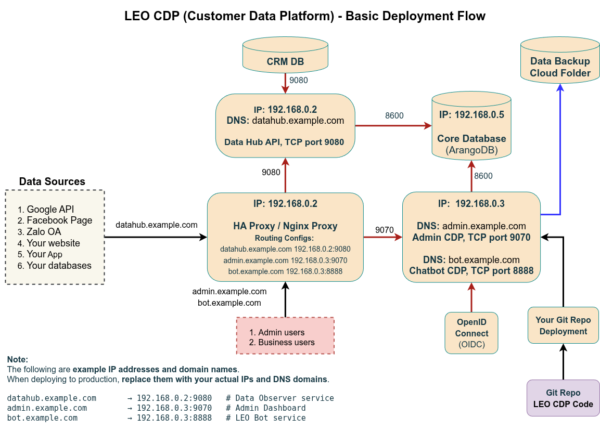

# LEO CDP Deployment for Multi-Server Environments

## Multi-Server Setup Guide

A full-scale LEO CDP deployment separates components into distinct servers for performance, maintainability, and fault isolation.
The diagram below represents the recommended architecture:

---

### 📊 LEO CDP Basic Deployment Flow



---

### 🧱 System Roles & Topology

| Role / Server              | Example DNS           | IP Address              | Service                              | Port     | Description                                                         |
| -------------------------- | --------------------- | ----------------------- | ------------------------------------ | -------- | ------------------------------------------------------------------- |
| **HA Proxy / Nginx Proxy** | `datahub.example.com` | `192.168.0.2`           | Reverse Proxy                        | 80 / 443 | Routes traffic to admin and observer nodes                          |
| **Observer Node**          | `datahub.example.com` | `192.168.0.2`           | `leo-observer-starter`               | 9080     | Collects and processes events from APIs, websites, and integrations |
| **Admin Node**             | `admin.example.com`   | `192.168.0.3`           | `leo-main-starter`                   | 9070     | Admin Dashboard and API management                                  |
| **LEO Bot Node**           | `bot.example.com`     | `192.168.0.3`           | `leo-bot` *(optional external repo)* | 8888     | AI assistant for chat automation and content generation             |
| **Core Database Node**     | —                     | `192.168.0.5`           | ArangoDB                             | 8600     | Main CDP data store (profiles, events, campaigns)                   |
| **Data Backup Storage**    | —                     | Cloud or mounted volume | —                                    | —        | Holds backup archives from ArangoDB                                 |

---

### 🔗 Network Flow Summary

1. **External sources** — Google API, Facebook, Zalo OA, websites, or apps — send data to
   → `datahub.example.com` (Observer Service)

2. **Nginx / HAProxy (192.168.0.2)** routes requests:

   * `datahub.example.com → 192.168.0.2:9080`
   * `admin.example.com → 192.168.0.3:9070`
   * `bot.example.com → 192.168.0.3:8888`

3. **Core Database (192.168.0.5:8600)** stores customer data and analytics.

4. **Backup Service** pushes scheduled exports to a secure cloud folder or mounted drive.

---

### ⚙️ Deployment Steps (Multi-Node)

#### 1️⃣ Prepare the Infrastructure

Each node must have:

* Ubuntu 22.04 LTS
* Java 11 (Amazon Corretto or OpenJDK)
* Redis client access (to shared Redis instance)
* SSH access via the dedicated user `cdpsysuser`

**Create the dedicated user:**

```bash
sudo useradd cdpsysuser -s /bin/bash -p '*'
sudo passwd -d cdpsysuser
sudo usermod -aG sudo cdpsysuser
echo 'cdpsysuser ALL=(ALL) NOPASSWD: ALL' | sudo tee -a /etc/sudoers >/dev/null
```

Set up SSH key access:

```bash
sudo su cdpsysuser
mkdir -p /home/cdpsysuser/.ssh
nano /home/cdpsysuser/.ssh/authorized_keys
```

---

#### 2️⃣ Install Core Components

On all nodes:

```bash
cd script-new-installation
sudo bash install-java.sh
sudo bash install-redis.sh
```

On the **database node** (`192.168.0.5`):

```bash
sudo bash install-database.sh
```

On the **proxy node** (`192.168.0.2`):

```bash
sudo bash install-nginx.sh
sudo bash install-certbot.sh
```

---

#### 3️⃣ Generate Metadata Configuration

On the **Admin node (192.168.0.3)**:

```bash
sudo su - cdpsysuser
cd /path/to/LEO-CDP-FREE-EDITION
bash setup-leocdp-metadata.sh
```

This generates `leocdp-metadata.properties`, where you must specify:

```properties
db.host=192.168.0.5
db.port=8600
redis.host=192.168.0.5
redis.port=6379
admin.domain=admin.example.com
observer.domain=datahub.example.com
bot.domain=bot.example.com
```

---

#### 4️⃣ Initialize Database (Admin Node Only)

```bash
bash setup-leocdp-database.sh
```

---

#### 5️⃣ Start Services by Node Role

| Node                       | Command                             | Service Description                                 |
| -------------------------- | ----------------------------------- | --------------------------------------------------- |
| **Observer (192.168.0.2)** | `bash start-observer.sh`            | Receives event data from external APIs and webhooks |
| **Admin (192.168.0.3)**    | `bash start-admin.sh`               | Admin UI and CDP management dashboard               |
| **Worker (192.168.0.3)**   | `bash start-data-connector-jobs.sh` | ETL and connector jobs                              |
| **All nodes**              | `bash stop-server.sh`               | Stop all CDP services                               |

---

### 🔄 Reverse Proxy (HAProxy / Nginx) Setup

Example `/etc/nginx/sites-available/leocdp.conf`:

```nginx
server {
    server_name datahub.example.com;
    location / {
        proxy_pass http://192.168.0.2:9080;
    }
}

server {
    server_name admin.example.com;
    location / {
        proxy_pass http://192.168.0.3:9070;
    }
}

server {
    server_name bot.example.com;
    location / {
        proxy_pass http://192.168.0.3:8888;
    }
}
```

Enable HTTPS with Certbot:

```bash
sudo certbot --nginx -d datahub.example.com -d admin.example.com -d bot.example.com
```

---

### 🧠 Notes & Best Practices

* Use **internal IPs** for ArangoDB and Redis; expose only Nginx to the internet.
* Keep `leocdp-metadata.properties` synchronized across nodes.
* Back up ArangoDB regularly to your **Data Backup Cloud Folder**.
* Never run `.jar` services as `root`; always use `cdpsysuser`.
* Logs from all upgrade operations are stored in `upgrade-leocdp.log`.

---

### 🌍 Example Production Configuration Summary

| Domain                | IP            | Role               | Ports         |
| --------------------- | ------------- | ------------------ | ------------- |
| `datahub.example.com` | `192.168.0.2` | Observer + Proxy   | 80, 443, 9080 |
| `admin.example.com`   | `192.168.0.3` | Admin Dashboard    | 9070          |
| `bot.example.com`     | `192.168.0.3` | LEO Bot (optional) | 8888          |
| `192.168.0.5`         | —             | ArangoDB           | 8600          |
| `192.168.0.5`         | —             | Redis              | 6379          |

---

With this structure, LEO CDP runs as a **distributed, secure, and maintainable platform**—mirroring the architecture in your deployment diagram.
It supports horizontal scaling (multiple observers or workers), secure separation of roles, and stable production operation.
